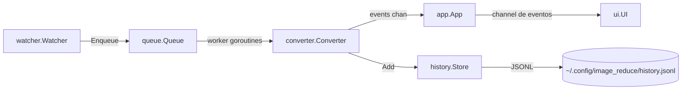

# AGENTS.md — Image Reduce

Guia para agentes de IA e colaboradores que trabalham neste repositório.

## Visão geral

Aplicativo de bandeja (system tray) para **Linux** escrito em **Go**. Monitora uma
pasta de entrada com `fsnotify`, converte novas imagens (PNG, JPEG, GIF estático,
BMP, TIFF) para **WebP lossy (qualidade 90, preservando alpha)** e move os
resultados para uma pasta de saída. Originais são movidos para
`processed/` (ou excluídos, conforme configuração). A UI é uma janela webview
(histórico + configurações) aberta a partir da bandeja.

## Comandos

| Comando | Descrição |
| --- | --- |
| `mise install` | Instala o Go 1.26.5 fixado no `mise.toml` |
| `mise run dev` | Roda em modo dev (`go run .`) |
| `mise run build` | Compila o binário (`go build -o image_reduce .`) |
| `mise run test` | Roda os testes (`go test ./...`) |
| `go build -o image_reduce .` | Build manual (sem mise) |
| `go test ./...` | Testes manuais |

## Estrutura do projeto

```
main.go                  Bootstrap: define env vars X11/WebKit, carrega config,
                         inicia App, roda tray (goroutine) e UI (loop principal)
internal/
  app/                   Orquestrador central (config, histórico, fila, conversor, watcher)
  config/                Configuração persistida em ~/.config/image_reduce/config.json
  converter/             Pipeline de conversão WebP + detecção de formato (e testes)
  history/               Histórico em memória + JSONL (máx. 500 eventos)
  queue/                 Fila de trabalhos com pool de workers dinâmico
  tray/                  Ícone e menu da bandeja (fyne.io/systray)
  ui/                    Janela webview (histórico + configurações)
  watcher/               Monitoramento da pasta (fsnotify)
third_party/webview_go/  Fork local do webview_go (webkit2gtk-4.1) — ver "Cuidados"
```

## Fluxo de dados



- `app.App` é o orquestrador: dono de todos os componentes e do canal
  `events` (buffer 256) que alimenta a UI.
- `queue.Queue` gerencia um número **dinâmico** de workers (`SetMax`), ajustável
  em runtime pela configuração.
- `converter.Converter` mantém um `Snapshot` imutável das opções (guardado por
  `sync.RWMutex`) para cada conversão; use `SetConfig` para atualizar em runtime.
- `history.Store` persiste cada evento em JSONL (append), com limite de 500
  entradas em memória.

## Convenções de código

- **Idioma:** todos os comentários, nomes de teste e documentação em
  **português**. Identificadores em inglês (Go idiomático).
- **Comentários de pacote:** cada pacote começa com `// Package ...` em
  português descrevendo sua responsabilidade.
- **Erros:** use `%w` ao envolver erros e retorne erros nas camadas de infra
  (config, watcher); componentes de longa duração (queue, history) não falham.
- **Concorrência:** proteja estado compartilhado com `sync.Mutex`/`sync.RWMutex`.
  Canais são usados para comandos (`ui.Command`) e eventos de progresso.
- **Nomes de teste:** `TestConvertPNGWithAlpha`, `TestDeleteOriginal`, etc. —
  sem underscores extras, descritivos do comportamento testado.
- **Helpers de teste:** use `t.Helper()` e `t.TempDir()`; crie fixtures de
  imagem programaticamente (ex.: `writePNG`) em vez de arquivos binários.
- **JSON:** structs de config/history usam tags `json` com `snake_case` e
  `omitempty` onde apropriado.

## Pontos de atenção (não quebrar)

- **`third_party/webview_go` é um fork local** apontado via `replace` no
  `go.mod`. Ele usa `webkit2gtk-4.1` no `#cgo pkg-config` e remove imports do
  Windows. Não remova o `replace` nem atualize o pacote upstream sem verificar
  a compatibilidade com webkit2gtk-4.1.
- **`main.go` define variáveis de ambiente críticas antes de tudo:**
  `GDK_BACKEND=x11`, `WEBKIT_DISABLE_DMABUF_RENDERER=1` e
  `WEBKIT_DISABLE_COMPOSITING_MODE=1`. Não remova — evitam tela preta/em branco
  em Wayland.
- **UI carregada via `data:text/html;base64,...`** (`//go:embed assets/index.html`),
  não via `SetHtml` — é mais robusto no WebKitGTK.
- **Config em runtime:** `app.SaveConfig` reinicia o watcher apenas quando
  `watch_dir` muda e ajusta o pool via `queue.SetMax` quando `max_concurrent`
  muda. Preserve esse comportamento.
- **Testes do converter** dependem de codecs registrados por imports
  blank (`_ "image/jpeg"`, `_ "golang.org/x/image/bmp"`, etc.). Não remova.
- **Depências de build (apt):** `libgtk-3-dev libwebkit2gtk-4.1-dev libwebp-dev`.
- **Canal de eventos:** `history.Event` é criado no `Converter` e enviado ao
  canal; se o consumidor não estiver pronto, use buffer ou evite bloquear
  workers (o canal tem buffer 256).

## Configuração e persistência

- Config: `~/.config/image_reduce/config.json` (ver `internal/config` para
  chaves e defaults).
- Histórico: `~/.config/image_reduce/history.jsonl`.
- Pastas padrão: `~/Pictures/image_reduce/in` e `~/Pictures/image_reduce/out`.
